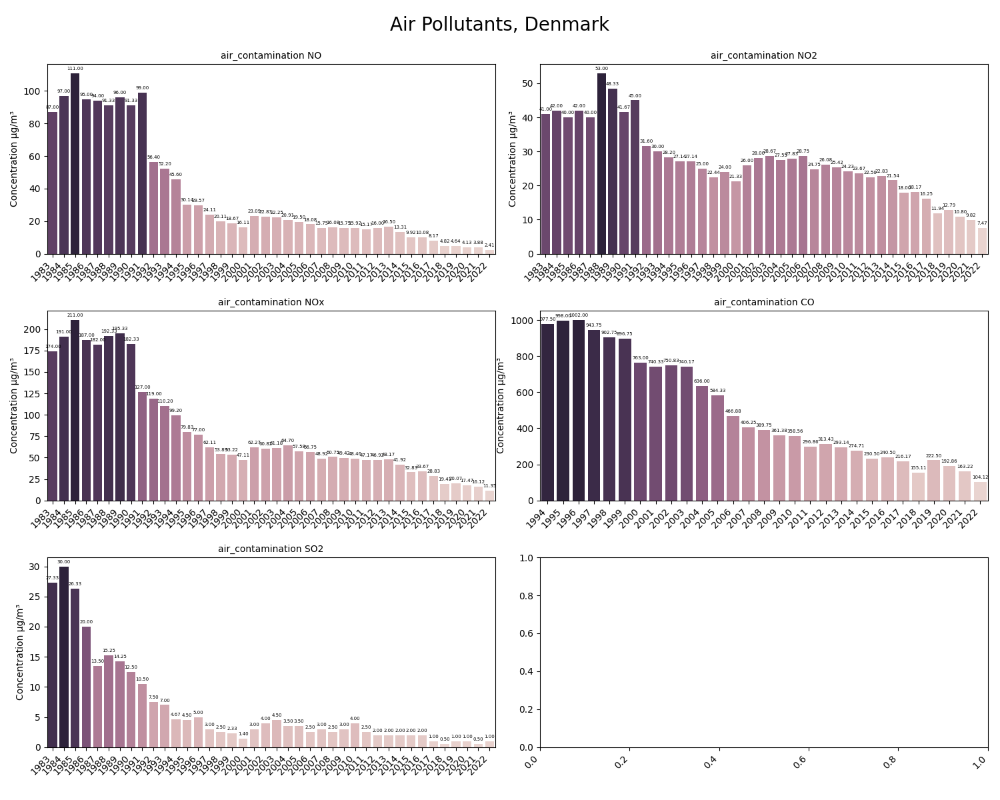
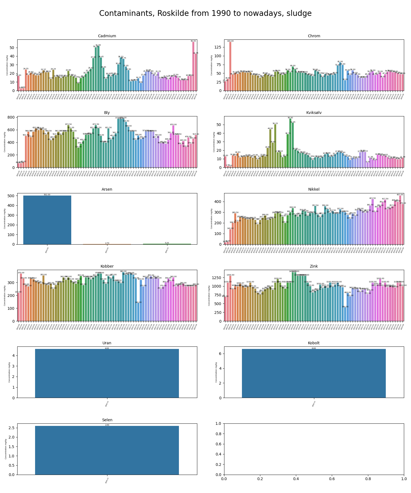
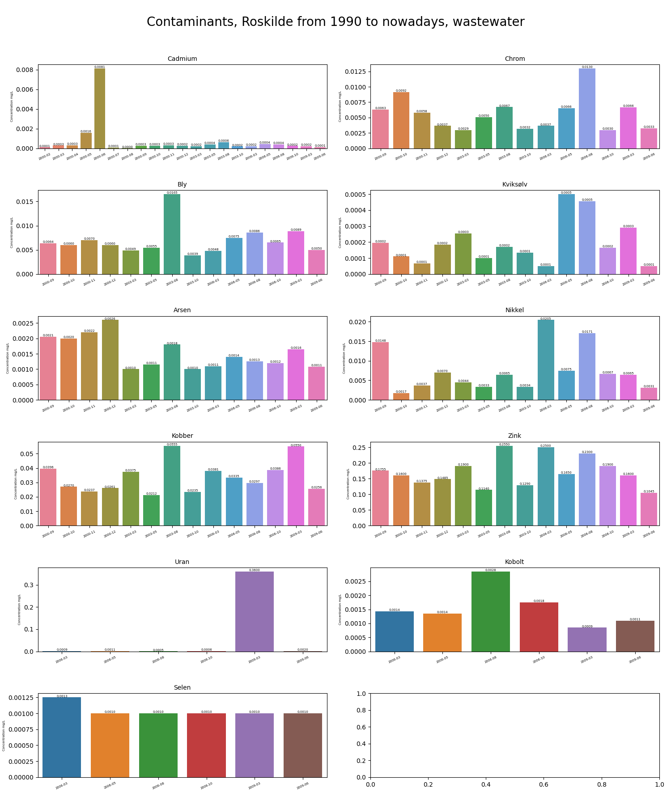

#**Processing of environmental data from miljoeportal.dk with data science approach using Python with Pandas library.**

First, what needs to be highlighted here is that Danes are exemplary. We should all follow their example. 
A great open data collection exists about environmental conditions for the past 40 years. 
It covers everything from water chemistry to species variety. And it is accessible for everyone.

There are some issues related to units, methods, and measurement strategies that I haven't been able to address. 

These include:

 - Misleading units: Confusing milligrams with micrograms.
 - Analysis of fjord bottom-shell: Investigating heavy metal pollutants.
 - Analysis of underground water: Examining areas where heavy metals were detected in slumps.
 - Inaccessibility of drinking water data: Data for residents is not available.

These data are unavailable to me and raise questions. Nevertheless, it's a valuable resource for students, enthusiasts, 
and activists to have all this information accessible.

Custom access is available for data on wastewater, lakes, lake-bottom conditions, rivers, and underground water.
You can obtain raw data in CSV format and manipulate it as needed.
Using Pandas, you can sort and extract relevant information from the extensive dataset.
Finally, you can visualize the data graphically using plots.

Lets go through the details.

Danish Air Quality

Based on public data from Aarhus University and the environmental monitoring department, 
Danish air can generally be considered clean, with no significant levels of pollutants detected.

 

It's likely that Denmark's lack of a significant metallurgy or chemical industry has contributed to its cleaner air. 
Additionally, government regulations, such as those related to agriculture, traffic, and building, 
have played a crucial role in reducing pollutant levels.

Underground Water

The available data on underground water is limited. Excel files only contain 30 lines of data for the past month, 
covering a few minerals and only five regions in Denmark. Data likely is in accesible scopes

Wastewater

The wastewater data revealed a wider range of pollutants than expected, including heavy metal pollutants 
and organic compounds found in sludge and water samples. Surprisingly, current data on heavy metal presence 
in wastewater is not publicly available.

To analyze this extensive dataset, we implemented a strategy to identify the maximum value of each contaminant, 
its location, and conduct a thorough review.

.png)
.png)

By delving deeper into specific locations, we can often access historical data. For example, 
the Roskilde slump was found to contain a wide range of harmful metals, including 
mercury (Hg), zinc (Zn), lead (Pb), arsenic (As), cadmium (Cd), nickel (Ni), cobalt (Co), uranium (U), and copper (Cu).
in Danish:
kviksølv (Hg), zink (Zn), bly (Pb), arsen (As), cadmium (Cd), nikkel (Ni), kobolt (Co), uran (U) og kobber (Cu)

To gain a better understanding of the long-term trend, we retrieved historical data for the past 40 years from 
the portal and visualized the levels of dangerous metal ions detected in the bottom sludge. As the plot indicates, 
the levels of these pollutants have remained relatively constant.

Unfortunately, the monitoring of the upper water layer is currently inaccessible. The last recorded data is from 2009.

The presence of uranium in the Roskilde slump is puzzling. It's likely that the local electrochemical 
production plant, which uses zinc, chrome, nickel, and other salts as electrolytes, is a contributing factor. 
Despite environmental regulations, it seems that these electrolytes have leaked into the local wastewater 
and eventually into the city's wastewater system.

Similar data analysis methods were applied to other facilities. For instance, the following visualization 
depicts data from the Kalundborg harbor, which houses a petroleum terminal and fertilizer storage:

Novo Nordisk Pharmacy Factory:

At the end additionally is applyed a table with limit permissible concentration of metal ions in wastewater
admited by WHO and other organizations

