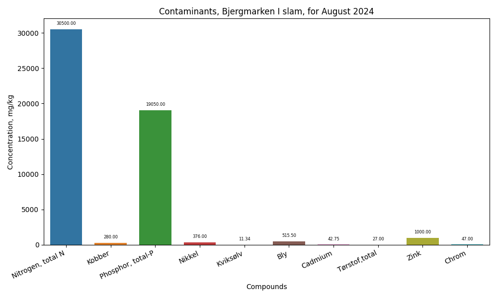
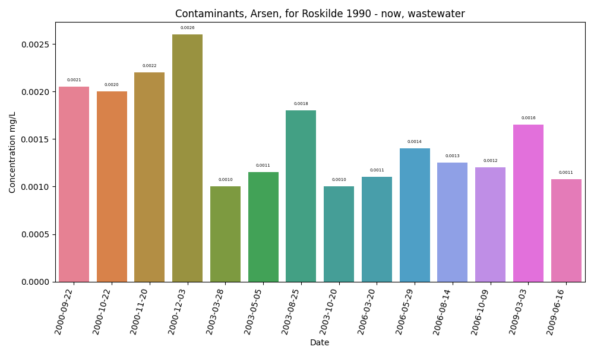

#Processing of environmental data from miljoeportal.dk with data science approach using Python with Pandas library.

First what needs to be highlighted here, Danes are model ones, who all we have to follow example of them. A great 
open data collection about environment condition for last 40 years. From chemistry of water to spices variety. 

There are some issues about units, ways and strategy of measurements, but I have treated open source data. These issues
will be left unanswered.
- misleading of units, milligrams vs micrograms
- analyze of  fjords bottom-shell for heavy metal pollutants
- analyze ow underground water in the area where heavy metals were detected in slumps. 
- drinking water data for sitisents are not accessible. 
These data are not available for me and evoke some questions.
But anyway, it is great possibilities for students, enthusiasts and activists to have all data on the table. 

For the custom access are available data with wastewater, lake, lake-bottom condition, rivers, underground water.
We can get raw data in csv format and manipulate with that in desirable way. 
With Pandas approach we can sort, extract from the gigantic data collection information which is interesting for us.
Visualise it graphically in plots after all.

Lets go through the details.

1. About Danish air. 
According to the public data from Aarhus University and environment monitoring department we can state
Danish air can be considered as clean without any limit presence of pollutants.

 

Presumably, it is because, Denmark does not have a metallurgy, chemical industry, as it might be. 
Government rules and regulations impacted in positive way an agriculture, traffic regulations, building area have been 
playing crucial role in pollutants rates declining.

2. Underground water. 
I don't know why, but very little information about it. Excel files contain only 30 lines for last month about some minerals 
and only for 5 areas in Denmark.

3. Wastewater

Here is much larger variety of data. Unpleasant surprise was a fact, that Denmark has those same problem as everywhere world 
around - human activity. 
Heavy metal pollutants, organic compounds were found in sludge of slumps and in water samples. Interesting fact is remained,
nowadays data about heavy metal presence in wastewater is not available.

Thus, here was implemented some strategy of investigation. As there was a couple of thousands of rows in Excel file for 
August 2024, was decided to print out a max value of each contaminant, its location area and to look through it. 

.png)
.png)

Then, going further seeing in details about some interesting location we can obtain historical data for it.
Here has been noticed a fact, Roskilde slump had a presence of a big variety of harmful metals there. 
Hg, Zn, Pb, As, Cd, Ni, Co, U, Cu

Was decided to retrieve a historical data of it for the last 40 years from the portal and visualize it in plot view for 
dangerous metal ions which were detected in sludge on the bottom. As it is visible, it still remains on that same level  

 
 [image](contamination_Chrome.png)

 [image](contamination_Pb.png)
 
 [image](contamination_Hg.png)

 [image](contamination_Nikkel.png)

 [image](contamination_Kobber.png)
 
 [image](contamination_Zink.png)

By unknown reason, monitoring of upper water lay is not accessible nowadays. Last measured data are from 2009 year.

 [image](contamination_Nikkel_wastewater.png)

 [image](contamination_Kobber_wastewater.png)

 [image](contamination_Zink_wastewater.png)

 [image](contamination_Uran_wastewater.png)

 [image](contamination_Kobolt_wastewater.png)

 [image](contamination_Selen_wastewater.png)

 [image](contamination_Chrom_wastewater.png)

 [image](contamination_Bly_wastewater.png)

 [image](contamination_Kviksølv_wastewater.png)

It is not understandable, what does Uranium, is doing in danish sump near Roskilde
 
Presumably, a reason of its presence is activity of local Plant which has to do to electrochemical production. 
Is well known, it demands of Zink, Chrome, Nikel etc salt as electrolysis components. Those electrolytes leak to the local
wastewater and then to the global city ones. 
Have been expected leading a such environmentally responsible productions has to be followed rules and norms. 
However data results show another history.

